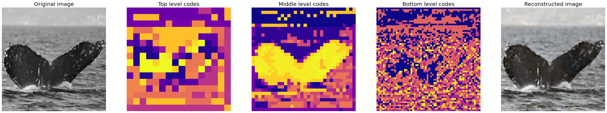

# Hierarchical VQ-VAE
## Introduction
Custom implementation of a 3-level hierarchical Vector Qantized Variational Autoencoder (VQ-VAE) based on the concepts introduced in [ Generating Diverse High-Fidelity Images with VQ-VAE-2](https://arxiv.org/pdf/1906.00446.pdf). The model and the PixelCNN priors are customized such that they can be trained, retaining reasonable performance for large 512x512 images, on free TPU and GPU machines offered on Kaggle and Colab. The model has been trained on the image data of the Kaggle competition [Humpback Whale Identification](https://www.kaggle.com/c/humpback-whale-identification) as this dataset offered a reasonable number of high resolution images.  
## How to use
For an overview of the functionality of the model, take a look at the example [colab notebook](https://colab.research.google.com/drive/1zLrX5q5zKA6dCbOWpepagYSYLzDNbc9v?usp=sharing).  
Weights of the VQ-VAE are stored in the github folder HVQVAE/hvqvae_weights. Weights for the priors, due to their larger dimensions, are stored in the public [Drive folder](https://drive.google.com/drive/folders/1V4ce7y4usuHOnH6sJKV1-ezeFVm8X1hx?usp=sharing).

## VQ-VAE architecture
The building block of the architecture are defined in hierarchical-VQ-VAE/HVQVAE/architecture.py.  
The 3 encoders (top level, middle level, bottom level) take the 512x512 RGB input images and map them through a series of strided convolutional layers to latent spaces of dimensions 16x16x64, 32x32x64, 64x64x64 respectively.  The middle level encoder is conditioned on the output of the top level encoder, the bottom level encoder is conditioned on the outputs of both top and middle level encoders. The encoders use an attention mechanism based on [CBAM: Convolutional Block Attention Module](https://arxiv.org/abs/1807.06521).  
Vectors in each latent space are passed to the quantizers corresponding to the respective level. Each quantizer take the 64 dimensional vectors composing the compressed latent tensors (16x16x64, 32x32x64, 64x64x64) for the corresponging level in the hierarchies and map them to a discrete space composed by a fixed number of learned vectors. These learned vectors are referred as the codebook, the number used to label them are called the codes. The top level codebook has 512 such vectors, the middle level 256, while the bottom level codebook has only 128. Notice that this is a major difference with the paper [ Generating Diverse High-Fidelity Images with VQ-VAE-2](https://arxiv.org/pdf/1906.00446.pdf) in which the codebook has 512 entries for all levels. The reason to reduce codebook dimension at lower levels is given by the fact that the hardware bottleneck is particular limiting for the PixelCNN priors and thus the performance of lower level priors (which need to be smaller since they operate with larger latent spaces) benefit from predicting out of a small number of vectors. The discretized latent vectors can be thought as compressed images (of dimensions 16x16, 32x32, 64x64) in which each pixel corresponds to an integer ranging from 0 to 512, 256, 128 for the 3 levels respectively (see figure below).   
The end result is each 512x512 RGB image is compressed to 3 images of dimension 16x16, 32x32, 64x64 in which each pixel is just an integer number up to 512, 128 or 64 respectively.  
The decoder takes the quantized compressed images (in which each pixel now corresponds to one of the vectors in the appropriate codebook) from the 3 levels and, by rescaling them to the original 512x512 size through transposed convolutional layers, tries to reconstruct the original 512x512 RGB image passed to the encoders.

  
Example of embedding latent codes and image reconstructed from these. Original image from the Humpback Whale Identification dataset.

## PixelCNN Priors

To learn the priors over the latent spaces, 3 autoregressive PixelCNN models based on [Conditional Image Generation with PixelCNN Decoders](https://arxiv.org/pdf/1606.05328.pdf) were trained. Due to hardware constraints the PixelCNN used differ significativily from the Pixel Snail used in the original VQ-VAE-2 paper. In particular multihead self-attention, requiring a lot of resources, was not used. To incorporate information from the global structure of the image, instead it was used a more lightweight attention mechanism based on a causal modification of [CBAM: Convolutional Block Attention Module](https://arxiv.org/abs/1807.06521) toghether with dilated convolutions.  
The three priors corresponding to the three different latent space "levels" (top, middle, and bottom) have been trained independently. The PixelCNN for the middle level is conditioned on the top level embedding codes of the corresponding image, the bottom prior is conditioned on both top and middle level codes. 
